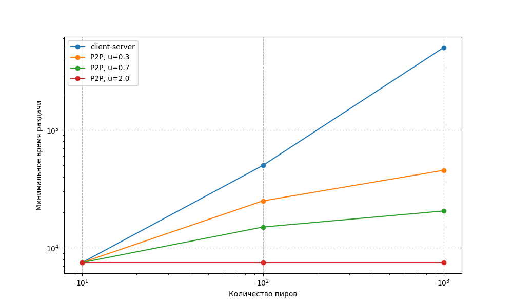

# Практика 5. Прикладной уровень

## Программирование сокетов.

### A. Почта и SMTP (7 баллов)

### 1. Почтовый клиент (2 балла)
Напишите программу для отправки электронной почты получателю, адрес
которого задается параметром. Адрес отправителя может быть постоянным. Программа
должна поддерживать два формата сообщений: **txt** и **html**. Используйте готовые
библиотеки для работы с почтой, т.е. в этом задании **не** предполагается общение с smtp
сервером через сокеты напрямую.

Приложите скриншоты полученных сообщений (для обоих форматов).

#### Демонстрация работы
todo

### 2. SMTP-клиент (3 балла)
Разработайте простой почтовый клиент, который отправляет текстовые сообщения
электронной почты произвольному получателю. Программа должна соединиться с
почтовым сервером, используя протокол SMTP, и передать ему сообщение.
Не используйте встроенные методы для отправки почты, которые есть в большинстве
современных платформ. Вместо этого реализуйте свое решение на сокетах с передачей
сообщений почтовому серверу.

Сделайте скриншоты полученных сообщений.

#### Демонстрация работы
todo

### 3. SMTP-клиент: бинарные данные (2 балла)
Модифицируйте ваш SMTP-клиент из предыдущего задания так, чтобы теперь он мог
отправлять письма с изображениями (бинарными данными).

Сделайте скриншот, подтверждающий получение почтового сообщения с картинкой.

#### Демонстрация работы
todo

---

_Многие почтовые серверы используют ssl, что может вызвать трудности при работе с ними из
ваших приложений. Можете использовать для тестов smtp сервер СПбГУ: mail.spbu.ru, 25_

### Б. Удаленный запуск команд (3 балла)
Напишите программу для запуска команд (или приложений) на удаленном хосте с помощью TCP сокетов.

Например, вы можете с клиента дать команду серверу запустить приложение Калькулятор или
Paint (на стороне сервера). Или запустить консольное приложение/утилиту с указанными
параметрами. Однако запущенное приложение **должно** выводить какую-либо информацию на
консоль или передавать свой статус после запуска, который должен быть отправлен обратно
клиенту. Продемонстрируйте работу вашей программы, приложив скриншот.

Например, удаленно запускается команда `ping yandex.ru`. Результат этой команды (запущенной на
сервере) отправляется обратно клиенту.

#### Демонстрация работы
todo

### В. Широковещательная рассылка через UDP (2 балла)
Реализуйте сервер (веб-службу) и клиента с использованием интерфейса Socket API, которая:
- работает по протоколу UDP
- каждую секунду рассылает широковещательно всем клиентам свое текущее время
- клиент службы выводит на консоль сообщаемое ему время

#### Демонстрация работы
todo

## Задачи

### Задача 1 (2 балла)
Рассмотрим короткую, $10$-метровую линию связи, по которой отправитель может передавать
данные со скоростью $150$ бит/с в обоих направлениях. Предположим, что пакеты, содержащие
данные, имеют размер $100000$ бит, а пакеты, содержащие только управляющую информацию
(например, флаг подтверждения или информацию рукопожатия) – $200$ бит. Предположим, что у
нас $10$ параллельных соединений, и каждому предоставлено $1/10$ полосы пропускания канала
связи. Также допустим, что используется протокол HTTP, и предположим, что каждый
загруженный объект имеет размер $100$ Кбит, и что исходный объект содержит $10$ ссылок на другие
объекты того же отправителя. Будем считать, что скорость распространения сигнала равна
скорости света ($300 \cdot 10^6$ м/с).
1. Вычислите общее время, необходимое для получения всех объектов при параллельных
непостоянных HTTP-соединениях
2. Вычислите общее время для постоянных HTTP-соединений. Ожидается ли существенное
преимущество по сравнению со случаем непостоянного соединения?

#### Решение
1. Посчитаем RTT:
    $$\frac{2 \cdot 10}{300 \cdot 10^6} = 6.67 \cdot 10^{-8}$$

Теперь посчитаем время передачи пакетов:
- для управляющего пакета: $l_u := \dfrac{200}{150} = 1.33$ с

- для 100Кбит объектов $l_o = \dfrac{100000}{150} = 666.67$ с

Для одного непостоянного HTTP-соединения нужно установить TCP-соединение и передать данные - это `1 RTT + 3 управляющих пакета + управляющий пакет с запросом` и `1 RTT + передача данных`. Суммарно
$$T = 2 \text{ RTT} + 4 l_u + l_o \approx 0 + 4 \cdot 1.33 + 666.67 = 5.33 + 666.67 = 672 \ c$$

Это мы скачали только исходную страницу с ссылками на другие объекты. Остальные будут скачиваться по скорости в 10 раз ниже, так как каждый из каналов получает $\dfrac{1}{10}$ пропускания общего канала.

Тогда, раз мы все равно опустили в подсчете времени RTT, итоговое время для каждого из 10 остальных объектов получится в 10 раз выше - 6720 секунд.

Но они делают это параллельно, из чего суммарное время передачи:
$$T_{total} \approx 672 + 6720 = 7392 \ c$$

2. Если же использовать постоянные HTTP-соединения, то все равно нужно будет получить данные, но мы можем не открывать TCP-соединение для каждого внутреннего объекта. Это сэкономит нам по 3 отправки управляющих пакетов на объект + RTT на объект, так как можно сразу запросить данные

Получается быстрее на $10 \cdot (3 \cdot 1.33 + \approx 0) = 39.9$  cекунд.

Это незначительно относительно всей передачи

### Задача 2 (3 балла)
Рассмотрим раздачу файла размером $F = 15$ Гбит $N$ пирам. Сервер имеет скорость отдачи $u_s = 30$
Мбит/с, а каждый узел имеет скорость загрузки $d_i = 2$ Мбит/с и скорость отдачи $u$. Для $N = 10$, $100$
и $1000$ и для $u = 300$ Кбит/с, $700$ Кбит/с и $2$ Мбит/с подготовьте график минимального времени
раздачи для всех сочетаний $N$ и $u$ для вариантов клиент-серверной и одноранговой раздачи.

#### Решение
Время на раздачу F бит N клиентам при клиент-серверном подходе 
$$D_{c-s} = \max(NF/u_s, F/d_{min})$$

В нашем случае $D_{c-s} = \max(15000 / 30 \cdot N, 15000 / 2) = \max(500 N, 7500)$ или $500 \cdot \max (N, 15)$

- при $N = 10$:
  $$D_{c-s} = 500 \cdot 15 = 7500 \ c$$

- при $N = 100$:
  $$D_{c-s} = 500 \cdot 100 = 50000 \ c$$

- при $N = 1000$:
  $$D_{c-s} = 500 \cdot 1000 = 500000 \ c$$

От u не зависит

Время на раздачу F бит N клиентам при одноранговом подходе
$$D_{P2P} = \max (F / u_s, F / d_{min}, NF / (u_s + \sum u_i))$$

В нашем случае $D_{P2P} = \max(15000 / 30, 15000 / 2, N \cdot 15000 / (30 + Nu)) = \max(7500,  15000 N / (30 + Nu))$

Вот график сравнения минимального временя на раздачу между P2P с разными параметрами u и client-server варианта.

(график логарифмический)

Для N = 1000 результаты следующие:
- $D_{c-s} = 500000 \ c$
- $P2P_{u=0.3} = 45454 \ c$
- $P2P_{u=0.7} = 20547 \ c$
- $P2P_{u=2} = 7500 \ c$

Видно, что клиент-серверная схема масштабируется сильно хуже одноранговой

### Задача 3 (3 балла)
Рассмотрим клиент-серверную раздачу файла размером $F$ бит $N$ пирам, при которой сервер
способен отдавать одновременно данные множеству пиров – каждому с различной скоростью,
но общая скорость отдачи при этом не превышает значения $u_s$. Схема раздачи непрерывная.
1. Предположим, что $\dfrac{u_s}{N} \le d_{min}$.
   При какой схеме общее время раздачи будет составлять $\dfrac{N F}{u_s}$?
2. Предположим, что $\dfrac{u_s}{N} \ge d_{min}$. 
   При какой схеме общее время раздачи будет составлять  $\dfrac{F}{d_{min}}$?
3. Докажите, что минимальное время раздачи описывается формулой $\max\left(\dfrac{N F}{u_s}, \dfrac{F}{d_{min}}\right)$?

#### Решение
1. Если
$$\frac{u_s}{N} \le d_{min}$$
то сервер может равномерно раздавать данные всем пирам с одинаковой скоростью
$$r_i = \frac{u_s}{N}$$

Так как
$$\frac{u_s}{N} \le d_{min} \le d_i$$
для любого пира $i$, каждый пир способен принимать данные с такой скоростью.

Тогда время получения файла каждым пиром:
$$T_i = \frac{F}{r_i} = \frac{F}{u_s/N} = \frac{NF}{u_s}$$

Получается когда все пиры получают данные параллельно и заканчивают одновременно, общее время раздачи:
$$T = \frac{NF}{u_s}$$

2. Если
$$\frac{u_s}{N} \ge d_{min}$$
то теперь бутылочным горлышком становится самый медленный пир.

В этом случае можно просто раздавать всем файл со скоростью $d_{min}$. Все будут справляться с такой скоростью, как и сервер будет справлятся такую скорость поддерживать, т.к. $u_s \geq d_{min} \cdot N$.

Тогда при такой схеме общее время раздачи составит
$$T = \frac{F}{d_{min}}$$

3. Докажем теперь общую формулу.

С одной стороны, серверу необходимо передать суммарно $NF$ бит данных всем пирам. Так как его суммарная скорость отдачи не превышает $u_s$, имеем нижнюю оценку:
$$T \ge \frac{NF}{u_s}$$

С другой стороны, самый медленный пир не может получить файл размера $F$ быстрее, чем за
$$T \ge \frac{F}{d_{min}}$$

Следовательно, для любой схемы раздачи обязательно:
$$T \ge \max\left(\frac{NF}{u_s}, \frac{F}{d_{min}}\right)$$

И понятно, что эта граница достижима если использовать стратегию из 1 или 2 пункта.